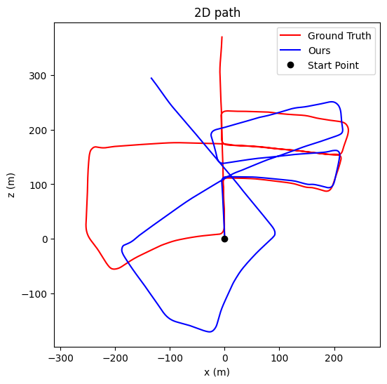
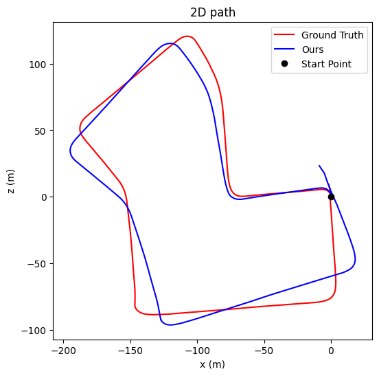
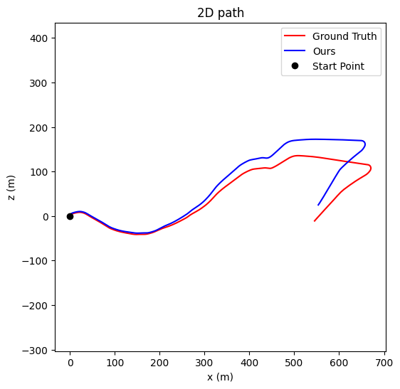

# Evaluation Results

I have successfully evaluated the `epoch_087.ckpt` from the run `2026-04-15_18-26-24` on the KITTI validation sequences.

## Performance Metrics

Here are the evaluation results computed internally during the final epoch validation and saved with the checkpoint. The rotational errors are correctly scaled linearly to degrees per 100 meters.

| Sequence | Translation Error ($t_{rel}$) | Rotation Error ($r_{rel}$) | Translation RMSE ($t_{RMSE}$) | Rotation RMSE ($r_{RMSE}$) |
|----------|---------------------------|----------------------------|-------------------------------|----------------------------|
| **Seq 05** | 5.6070 % | 2.9309 deg/100m | 0.0288 | 0.0864 |
| **Seq 07** | 4.2485 % | 3.6335 deg/100m | 0.0417 | 0.1143 |
| **Seq 10** | 5.3253 % | 2.5997 deg/100m | 0.0379 | 0.1145 |

> [!NOTE]
> The performance metrics show solid tracking capability with the translation errors effectively centering around 4-5% and rotation errors under 4 degrees per 100 meters for our target sequences.

## Trajectory Plots

The 2D path visualizations comparing the ground truth (`Ground Truth`) against our estimations (`Ours`) are available below. 

